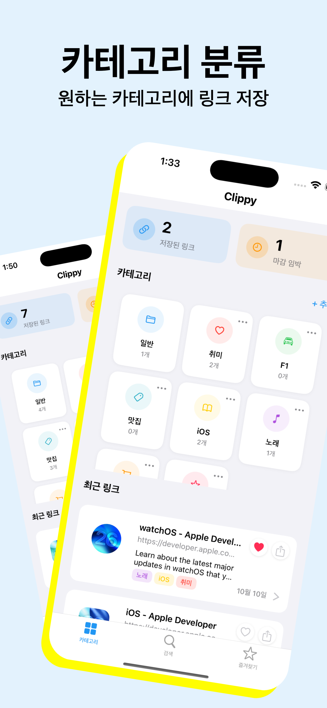
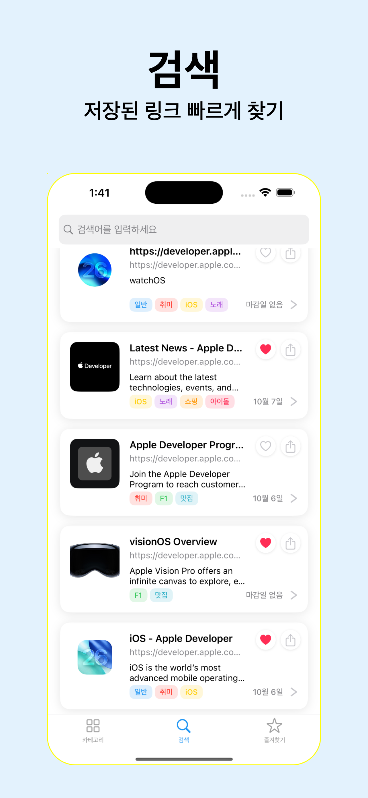
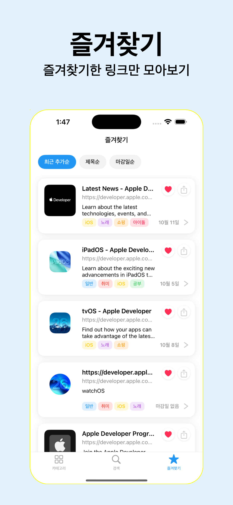

# 📎 Clippy

> 링크를 체계적으로 관리하고 마감일을 놓치지 않도록 도와주는 앱


[](https://apps.apple.com/kr/app/clippy-%EB%A7%81%ED%81%AC-%EC%A0%80%EC%9E%A5-%ED%8F%B4%EB%8D%94-%EB%B6%84%EB%A5%98-%EB%A7%88%EA%B0%90%EC%9D%BC-%EC%95%8C%EB%A6%BC/id6753625594)

## 📱 소개

**Clippy**는 링크를 카테고리별로 체계적으로 관리하고, 마감일이 있는 링크에 대해 알림을 제공하는 앱입니다. 웹 링크의 메타데이터를 자동으로 추출하여 썸네일과 제목을 제공하며, 즐겨찾기 기능과 검색 기능을 통해 효율적인 링크 관리를 지원합니다.

## ✨ 주요 기능

### 🗂️ 카테고리 관리
- 링크를 카테고리별로 분류하여 체계적으로 관리
- 커스텀 카테고리 생성 및 편집
- 카테고리별 색상 및 아이콘 설정
- 기본 "일반" 카테고리 제공

### 🔗 링크 저장 및 관리
- URL 입력 시 자동으로 메타데이터 추출 (제목, 썸네일, 설명)
- 링크별 메모 추가 기능
- 마감일 설정 및 관리
- 읽음/안읽음 상태 표시

### ⏰ 알림 시스템
- 마감일 하루 전 자동 알림
- 로컬 알림 스케줄링 시스템
- 알림 권한 요청 및 관리
- 마감 임박 링크 하이라이트

### 🔍 검색 및 필터링
- 제목, URL, 설명 기반 실시간 검색
- 즐겨찾기 링크만 별도 관리
- 최근 추가순, 제목순, 마감일순 정렬

### 📊 통계 및 대시보드
- 저장된 링크 총 개수 표시
- 마감 임박 링크 개수 표시
- 최근 추가된 링크 목록

## 📱 스크린샷

<div align="center">
  
  
  
  
</div>

## 🛠️ 기술 스택

### Frontend
- **Swift 5.0+** 
- **UIKit** 
- **SnapKit** 
- **RxSwift/RxCocoa** 

### Backend & Database
- **Realm** 
- **Firebase** 

### Architecture
- **MVVM + Input/Output** 
- **Repository Pattern** 

## 📁 프로젝트 구조

```
Clippy/
├── AppDelegate.swift              # 앱 진입점 및 Firebase 설정
├── SceneDelegate.swift            # Scene 생명주기 관리
├── Base/
│   └── BaseViewController.swift   # 기본 뷰컨트롤러
├── DataBase/
│   ├── RealmTable.swift           # Realm 데이터 모델
│   └── CategoryRepository.swift   # 데이터 접근 계층
├── Manager/
│   ├── LinkManager.swift          # 링크 관리 로직
│   ├── NotificationManager.swift  # 알림 관리
│   └── TooltipManager.swift       # 사용자 가이드
├── Model/
│   └── LinkMetadata.swift         # 링크 메타데이터 모델
├── View/
│   ├── Category/                  # 카테고리 관련 화면
│   ├── EditCategory/              # 카테고리 편집
│   ├── EditLink/                  # 링크 편집
│   ├── Like/                      # 즐겨찾기 화면
│   ├── LinkDetail/                # 링크 상세 화면
│   ├── LinkList/                  # 링크 목록 화면
│   ├── Search/                    # 검색 화면
│   └── Tooltip/                   # 사용자 가이드
├── Extension/                      # 확장 기능
├── Resource/                      # 리소스 및 유틸리티
└── Assets.xcassets/               # 앱 아이콘 및 이미지
```

## 🚀 주요 기술적 도전과제

### 1. 메타데이터 자동 추출 시스템
- **문제**: URL만으로 제목, 썸네일, 설명을 자동으로 추출해야 함
- **해결**: Apple의 LinkPresentation 프레임워크를 활용한 메타데이터 자동 수집
- **결과**: 사용자 입력 없이 자동으로 링크 정보 완성

### 2. 실시간 알림 시스템 구현
- **문제**: 마감일 하루 전 정확한 알림 발송 및 백그라운드 처리
- **해결**: 로컬 알림 스케줄링 및 Firebase Messaging 연동 (향후 구현)
- **결과**: 앱이 종료되어도 안정적인 알림 제공

### 3. 반응형 UI 구현
- **문제**: 다양한 데이터 변화에 따른 실시간 UI 업데이트
- **해결**: RxSwift를 활용한 데이터 바인딩 및 상태 관리
- **결과**: 사용자 액션에 즉각적인 반응하는 부드러운 UX

### 4. 로컬 데이터베이스 최적화
- **문제**: 대량의 링크 데이터 효율적 저장 및 검색
- **해결**: Realm을 활용한 관계형 데이터 모델링 및 인덱싱
- **결과**: 빠른 검색 성능과 안정적인 데이터 관리

## 👨‍💻 개발 정보

- **개발 기간**: 
  - 핵심 개발: 2025.09.24 ~ 2025.10.03 (10일)
  - 유지보수: 2025.10.04 ~ 현재 (지속적 개선)
- **개발 인원**: 1명 (개인 프로젝트)
- **역할**: 기획, 디자인, 개발, 배포 전담
- **최소 지원 버전**: iOS 16.0+
- **개발 환경**: Xcode 16.4+, Swift 5.0+

## 🎓 학습 및 적용 기술

### 아키텍처 & 디자인 패턴
- **MVVM 패턴**: View와 비즈니스 로직 분리
- **Repository Pattern**: 데이터 접근 계층 추상화
- **Observer Pattern**: RxSwift를 통한 반응형 프로그래밍

### iOS 개발 기술
- **UIKit**: 네이티브 iOS UI 구현
- **Auto Layout**: SnapKit을 활용한 코드 기반 레이아웃
- **UserNotifications**: 로컬 알림 시스템 구현
- **LinkPresentation**: Apple 프레임워크를 활용한 링크 메타데이터 자동 추출

### 데이터 관리
- **Realm**: 로컬 데이터베이스 설계 및 최적화
- **데이터 모델링**: 관계형 데이터베이스 설계

### 외부 서비스 연동
- **Firebase Analytics**: 사용자 행동 분석 및 앱 사용 패턴 파악
- **Firebase Crashlytics**: 앱 크래시 모니터링 및 안정성 개선
- **Firebase Messaging**: 푸시 알림 서비스 (향후 구현 예정)

## 📞 문의사항

프로젝트에 대한 문의사항이 있으시면 언제든 남겨주세요.

[📝 문의하기](https://docs.google.com/forms/d/e/1FAIpQLSf9TrZJPPv5E3wA16mhgbTF02z1VVVOfZJ7xoiL2L1sJhZDTw/viewform)

---

**Clippy** - 링크 관리의 새로운 경험을 제공합니다! 📎✨
